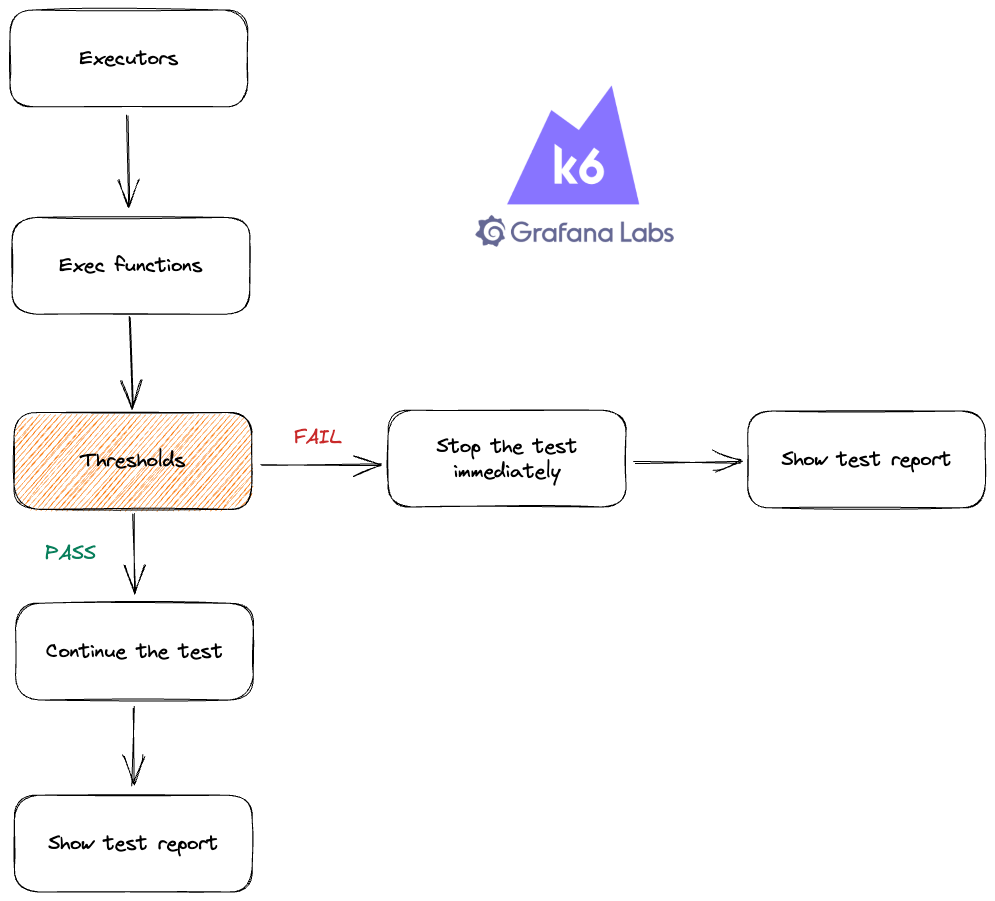

# Improve Application Resiliency With Chaos Testing

- [Improve Application Resiliency With Chaos Testing](#improve-application-resiliency-with-chaos-testing)
  - [(1) Tutorial Intro](#1-tutorial-intro)
    - [(1.1) Introduction](#11-introduction)
      - [(1.1.1) What is chaos testing?](#111-what-is-chaos-testing)
      - [(1.1.2) Why implement chaos testing?](#112-why-implement-chaos-testing)
      - [(1.1.3) Chaos xk6-disruptor](#113-chaos-xk6-disruptor)
        - [(1.1.4) Pod disruptor](#114-pod-disruptor)
        - [(1.1.5) Service disruptor](#115-service-disruptor)
      - [(1.1.6) Chaos testing example :smiling\_imp:](#116-chaos-testing-example-smiling_imp)
    - [(1.2) Prerequisites](#12-prerequisites)
    - [(1.3) Setting up a Kubernetes cluster :nerd\_face:](#13-setting-up-a-kubernetes-cluster-nerd_face)
  - [(2) Deployments :rocket:](#2-deployments-rocket)
    - [(2.1) Deploy provider API service](#21-deploy-provider-api-service)
      - [(2.1.1) Going through the files inside the service directory](#211-going-through-the-files-inside-the-service-directory)
      - [(2.1.2) Building the service image and push it to Docker Hub :building\_construction:](#212-building-the-service-image-and-push-it-to-docker-hub-building_construction)
      - [(2.1.3) Deploying the service to the Kubernetes cluster :rocket:](#213-deploying-the-service-to-the-kubernetes-cluster-rocket)
    - [(2.2) Deploy consumer API service :rocket:](#22-deploy-consumer-api-service-rocket)
      - [(2.2.1) Going through the files inside the service directory](#221-going-through-the-files-inside-the-service-directory)
      - [(2.2.2) Building the service image and push it to Docker Hub](#222-building-the-service-image-and-push-it-to-docker-hub)
      - [(2.2.3) Deploying the service to the Kubernetes cluster](#223-deploying-the-service-to-the-kubernetes-cluster)
  - [(3) Chaos Testing](#3-chaos-testing)
    - [(3.1) Installing k6 and xk6-disruptor](#31-installing-k6-and-xk6-disruptor)
    - [(3.2) Implementing chaos testing scenarios](#32-implementing-chaos-testing-scenarios)
    - [(3.3) Root cause analysis](#33-root-cause-analysis)
    - [(3.4) Solution](#34-solution)
  - [(4) Conclusion](#4-conclusion)


## (1) Tutorial Intro

### (1.1) Introduction

Testing is essential to ensure that your software application performs as expected. No doubt about it. But even if your application runs smoothly in a testing environment, unexpected incidents can occur in production, such as a crashed database or a lost connection to a third-party service. To ensure your application can handle such incidents and minimize their impact, you need to incorporate chaos testing into your delivery process. In this article, we’ll explore how to implement chaos testing using k6 for two backend services, to help you ensure the resilience of your application.

#### (1.1.1) What is chaos testing?
Chaos testing is a software testing methodology that involves intentionally injecting faults and disruptions into your application to identify its weaknesses. It is often used with other testing methodologies, such as functional, load, and performance, to ensure your application’s overall quality and reliability.

#### (1.1.2) Why implement chaos testing?
Chaos testing ensures that your application can withstand unexpected failures and disruptions in a production environment. By simulating different scenarios and failure modes, you identify potential issues in your app and develop solutions to resolve them.

#### (1.1.3) Chaos xk6-disruptor

Currently, the xk6-disruptor only supports chaos testing for an application running in Kubernetes. The xk6-disruptor runs in your local machine and has two main components:

The xk6-disruptor extension works as a Javascript API to inject faults into your app through Kubernetes components, whether through Kubernetes pods (using PodDisruptor) or Kubernetes services (using ServiceDisruptor).
The xk6-disruptor-agent is installed into the Kubernetes by the xk6-disruptor. Then the xk6-disruptor-agent will inject faults into the Kubernetes component (Kubernetes pod or service) according to instructions from the xk6-disruptor extension.
So, put it simply, the extension exposes the Javascript API, and the agent will inject the faults.

##### (1.1.4) Pod disruptor

The xk6-disruptor extension uses Pod disruptor to inject faults to the app inside the Kubernetes cluster in three steps:

The pod disruptor chooses the application pod that it wants to inject faults into
The pod disruptor attaches the disruptor agent to the application pod
The disruptor agent injects faults into the application container
The below diagram illustrates how the pod disruptor works:


##### (1.1.5) Service disruptor

The xk6-disruptor extension uses the service disruptor as a wrapper around the pod disruptor. Basically, the service disruptor works in three steps:

The service disruptor chooses the Kubernetes service pod that it wants to inject faults into
The service disruptor creates a pod disruptor to interact with the Kubernetes service pod through the pod disruptor
The pod disruptor attaches the disruptor agent to the Kubernetes service pod, then the disruptor agent injects faults into the application container.

#### (1.1.6) Chaos testing example :smiling_imp:

To better understand how to apply chaos testing for a software application, let’s build two simple backend services, as detailed below:

**Service 1**: a Go service that creates an API to display the current timestamp. Let’s call this API a get time API.
**Service 2**: a Go service that implements an API consuming the get time API. This API will respond “Successfully consuming message” if the response status code of the get timestamp API is 200. Let’s call this API a consuming API

You will build these services using the following three steps:

- Clone the GitHub repository
- Build the Docker image for each service using Dockerfile
- Deploy each service to the Kubernetes cluster

### (1.2) Prerequisites

To follow along with the steps in the article, you need to fulfill the following prerequisites:

* [Git](https://git-scm.com/book/en/v2/Getting-Started-Installing-Git) installed
* [Docker engine](https://docs.docker.com/engine/install/ubuntu/) in your machine to build the service images.
* The [kubectl](https://kubernetes.io/docs/tasks/tools/install-kubectl-linux/) command line tool to interact with the Kubernetes cluster.
* Have an account on Docker hub to store the service images.

### (1.3) Setting up a Kubernetes cluster :nerd_face:
You can set up a Kubernetes cluster by using cloud provider-supported tools like [Vultr Kubernetes](https://www.vultr.com/kubernetes/), [AWS Elastic Kubernetes Engine](https://aws.amazon.com/eks/), or [Google Kubernetes Engine](https://cloud.google.com/kubernetes-engine). Or you can create your own Kubernetes cluster setup using tools like [Minikub](https://minikube.sigs.k8s.io/docs/) or [kind](https://kind.sigs.k8s.io/). To make things simpler, let’s use Minikube to set up the Kubernetes cluster.

Open a new terminal in your local machine and run the following commands to install Minikube:

```
// First, download the minikube client tool to the current directory
curl -Lo minikube https://storage.googleapis.com/minikube/releases/latest/minikube-linux-amd64

// Make the minikube client to be executable
chmod +x minikube

// Create a new directory in /usr/local/bin 
sudo mkdir -p /usr/local/bin/

// Install minikube into /usr/local/bin directory
sudo install minikube /usr/local/bin/
```

Then start the Minikube service in your current machine by running the below command:
```
minikube start
```
To check whether the Kubernetes cluster is running by using Minikube, run the below command:
```
kubectl get node
``` 
You should see the similar output to that shown below:

```
NAME       STATUS   ROLES           AGE    VERSION
minikube   Ready    control-plane   145m   v1.26.3
```

Now you are all set and ready to deploy your services! :hugs:

## (2) Deployments :rocket:

### (2.1) Deploy provider API service

#### (2.1.1) Going through the files inside the service directory

The current structure of the directory looks like the listing below:
```
.
├── chaos-test.js
├── deployment.yml
├── Dockerfile
├── go.mod
├── go.sum
├── provider.go
└── service.yml
```
1. The **chaos-test.js** file is for defining the chaos testing scenario for your test. Let’s skip this file for now. You will learn about this file in detail in the “Implementing chaos testing scenarios” sub-section.

2. The **go.mod** and **go.sum** files define the service dependencies to be run.

3. The **provider.go** file implements all the logic of the service. You create an API that shows the current timestamp in the response body.

```
package main

import (
  "fmt"
  "Time"

  "github.com/gin-gonic/gin"
)

func main() {
  r := gin.New()

  r.GET("/", func(c *gin.Context) {
    c.String(200, "Current time is: "+fmt.Sprint(time.Now().Unix()))
  })

  r.Run(":3000")
}
```
The service will use the [Gin](https://gin-gonic.com/) framework to implement the web service and will run on port 3000.

4. The Dockerfile defines all the steps to build the service image so that you will deploy the service to Kubernetes later on using this image.
   
```
FROM golang:1.19-alpine

WORKDIR /app

COPY go.mod ./
COPY go.sum ./
RUN go mod download

COPY *.go ./

RUN go build -o /main

CMD [ "/main" ]
```

To build the Docker image, Docker will perform the following steps :

- Use the “golang:1.19-alpine” image as a Go run time
- Set the working directory to “/app” path
- Copy go.mod, go.sum file to the work directory
- Install the dependencies using go mod download
- Copy all the go files in the root directory to the “/app” path
- Run the go build -o /main to package the service into an execution file named “main”
- Set command to run the service inside the Docker container using “main” execution file

5. The **deployment.yml** file defines the deployment configuration to create the Kubernetes pods for the service.
   
```
---
apiVersion: apps/v1
kind: Deployment
metadata:
  name: provider-chaos
spec:
  replicas: 5
  selector:
    matchLabels:
      name: provider-chaos
  template:
    metadata:
      labels:
        name: provider-chaos
    spec:
      containers:
      - name: application
        image: your_docker_hub_account/provider-chaos:latest
        imagePullPolicy: Always
        envFrom:
        - secretRef:
            name: dockerhub-secret
        ports:
          - containerPort: 3000
```

The Kubernetes cluster will execute the deployment to:

- Create five pods since the number of replicas is “5”.
- Name the pods with the prefix “provider-chaos” since the selector.matchLabels.name value is “provider-chaos”.
- Create the pods using the container image. Modify this line so it uses your Docker Hub account name.
- To access the Docker Hub image, Kubernetes will use the secret variable named dockerhub-secret. As a security best practice, you should not show your Docker Hub credentials in a deployment file. Instead, you need to create a secret variable and then access it via the Kubernetes deployment file. You will create this secret variable later in this section.
- Kubernetes expose the running service container via port “3000”.
You need to replace “your_docker_hub_account” with your actual value at the line “image: your_docker_hub_account/provider-chaos:latest” in the deployment.yml file.

6. The **service.yml** file defines a Kubernetes service as a load balancer so that you can access the demo service from outside the Kubernetes cluster.

```
---
apiVersion: v1
kind: Service
metadata:
  name: provider-chaos-service
spec:
  type: LoadBalancer
  ports:
  - name: HTTP
    port: 3001
    targetPort: 3000
  selector:
    name: provider-chaos
```
The Kubernetes cluster will :

- Create a new service with the name as “provider-chaos-service” and type “LoadBalancer”
- Select all the running pods with the prefix “provider-chaos”
- Access these pods via port “3000”
- Then expose these pods via port “3001”

#### (2.1.2) Building the service image and push it to Docker Hub :building_construction:

In order to deploy the service to the Kubernetes cluster, you need to create the Docker image first. From the current terminal, run the following command to create a new Docker image and replace “your_docker_hub_account” with your actual Docker Hub account value.

```
docker build -t your_docker_hub_account/provider-chaos .
```

You should see a similar output as that shown below:
```
...
 => [3/7] COPY go.mod ./    0.1s
 => [4/7] COPY go.sum ./     0.1s
 => [5/7] RUN go mod download   6.7s
 => [6/7] COPY *.go ./                                              0.1s
 => [7/7] RUN go build -o /main                                            16.2s
 => exporting to image                                          3.1s
 => => exporting layers            3.1s
 => => writing image sha256:b714907f712bf2889cde0840e83fdb4b20d4e167aee3462880d28517afb47c1f      0.0s
 => => naming to docker.io/your_docker_hub_account/provider-chaos
```

Log in to Docker Hub from the current terminal by running:

```
docker login
```

The docker command line will ask for your Docker Hub account name and password. After providing your values, you should see the following output showing that you have logged in to Docker Hub successfully.

```
Authenticating with existing credentials...
WARNING! Your password will be stored unencrypted in /home/donald/.docker/config.json.
Configure a credential helper to remove this warning. See
https://docs.docker.com/engine/reference/commandline/login/#credentials-store

Login Succeeded
```

Finally, run the following command to publish the service image to your Docker Hub page and replace “your_docker_hub_account” with your actual value.

```
docker push your_docker_hub_account/provider-chaos
```


You should see the following output:

```
Using default tag: latest
The push refers to repository [docker.io/your_docker_hub_account/provider-chaos]
363f5106a57e: Pushed 
2722c1fdbed8: Pushed 
6c35a8e7f30c: Pushed 
20cb7f1cf854: Pushed 
368e5a7a0116: Pushed 
73b40ab56d66: Layer already exists 
d0bf2a758a06: Layer already exists 
10691ab46c83: Layer already exists 
d270ab11cf6e: Layer already exists 
7cd52847ad77: Layer already exists 
latest: digest: sha256:f5b5fd30150b88ab0b6fec772bcde7d69c7df371181af5c80cd395bae79cfab3 size: 2410
```

Now that you have successfully pushed the service image to Docker Hub. Let’s move on to deploy the service to the Kubernetes cluster. :rocket:

#### (2.1.3) Deploying the service to the Kubernetes cluster :rocket:

You need to create a Kubernetes secret named dockerhub-secret to allow Kubernetes to get access to the Docker Hub images. Run the following command to do it, replace “your_docker_hub_user”, “your_docker_hub_password”, and “your_docker_hub_email” with your actual values.


```
kubectl create secret docker-registry dockerhub-secret \
  --docker-server=docker.io \
  --docker-username=your_docker_hub_user \
  --docker-password=your_docker_hub_password \
  --docker-email=your_docker_hub_email
```

You should see the following output from the console showing that you have successfully created the “dockerhub-secret” secret.

```
secret/dockerhub-secret created
```
Then, you deploy the Kubernetes pods for the application service using deployment.yml file by running the following command:

```
kubectl apply -f deployment.yml
```

You should see the following output:


```
deployment.apps/provider-chaos created
```

By default, Minikube does not come with LoadBalancer support activated. You need to run the following command to set up the load balancer in your local machine. This will allow you to access the API service from outside the Kubernetes cluster using a Kubernetes service component. Open up a new terminal and run the following command:

```
minikube tunnel
```

You should see the following output which shows that you have successfully started the minikube tunnel process:

```
Status:
        machine: minikube
        pid: 79041
        route: 10.96.0.0/12 -> 192.168.49.2
        minikube: Running
        services: []
    errors:
                minikube: no errors
                router: no errors
                loadbalancer emulator: no errors

```

Keep this terminal open so that the tunnel process does not stop.

Finally, you deploy the Kubernetes service so that you can access the application service from outside the Kubernetes cluster.

```
kubectl apply -f service.yml
```

You should see the following output:

```
service/provider-chaos-service created
```

Run the following command to get information about all the running Kubernetes services:
```
kubectl get service
```

You should see a similar output to that shown below:

```
NAME                TYPE           CLUSTER-IP      EXTERNAL-IP     PORT(S)          AGE
kubernetes          ClusterIP      10.96.0.1       <none>          443/TCP          130m
provider-chaos-service   LoadBalancer   10.105.156.41   10.105.156.41   3001:30057/TCP   104s
```

Now the “EXTERNAL-IP” for “provider-chaos-service” is available at the address is “10.105.156.41”. You can try to make an API request to the API to get the current timestamp by running the following command. Remember to replace “139.180.223.84” with your actual EXTERNAL_IP value.

```
curl --location 'http://10.105.156.41:3001/'
```

You should see a similar output to that shown below:

```
Current time is: 1679546283
```

You have now successfully deployed the get time API to the Kubernetes cluster and are able to access the API from your local machine. Let’s move on to deploying the consuming API service.

### (2.2) Deploy consumer API service :rocket:

#### (2.2.1) Going through the files inside the service directory

The current structure of the directory looks like the following:

```
.
├── deployment.yml
├── Dockerfile
├── go.mod
├── go.sum
├── consumer.go
└── service.yml
```
1. The **go.mod** and **go.sum** files are for defining the dependencies that the service needs to use.

2. The **consumer.go** defines all the logic of this service. This service implements an API with the path as “/consuming”, which makes an API request to the get current timestamp API, then responds with the appropriate message depending on the status code of the get current timestamp API.

```
package main

import (
  "fmt"
  "net/HTTP"
  "os"

  "github.com/gin-gonic/gin"
)

func main() {
  r := gin.New()

  r.GET("/consuming", func(ctx *gin.Context) {

    response, err := http.Get(fmt.Sprintf("http://%s:%s/", os.Getenv("PROVIDER_URL"), os.Getenv("PROVIDER_PORT")))
    if err != nil {
      fmt.Printf("error making http request: %s\n", err)
      os.Exit(1)
    }

    if response.StatusCode == 200 {
      ctx.String(200, "Successfully consuming message")
    } else {
      ctx.String(500, "Internal server error")
    }

  })

  r.Run(":3000")
}
```
This consuming API will return “200” status code with the message “Successfully consuming message” if the get current timestamp API responds with a 200 status code. If the get current timestamp API returns another status code other than “200”, the consuming API will return a “500” status code with the message “Internal server error”.

The consuming API will get the domain and port of the get current timestamp API from environment variables with the keys PROVIDER_URL and PROVDER_PORT. You will provide these environment variables to the Kubernetes pod using the Kubernetes config map.

3. The **Dockerfile** defines all the steps to build the Docker image for the consuming API service. It looks the same as the Dockerfile for the get current timestamp API service.


```
# syntax=docker/dockerfile:1

FROM golang:1.19-alpine

WORKDIR /app

COPY go.mod ./
COPY go.sum ./
RUN go mod download

COPY *.go ./

RUN go build -o /main

CMD [ "/main" ]
```

The **deployment.yml** file tells Kubernetes to create the pods and the config map for the consuming API service.


```
---
apiVersion: apps/v1
kind: Deployment
metadata:
  name: consumer-chaos
spec:
  replicas: 5
  selector:
    matchLabels:
      name: consumer-chaos
  template:
    metadata:
      labels:
        name: consumer-chaos
    spec:
      containers:
      - name: application
        image: your_docker_hub_account/consumer-chaos:latest
        imagePullPolicy: Always
        envFrom:
        - secretRef:
            name: dockerhub-secret
        ports:
          - containerPort: 3000
        env:
        # Define the environment variable
        - name: PROVIDER_URL 
          value: provider-chaos-service
        - name: PROVIDER_PORT
          value: "3001"
```

You need to make some modifications to the file to match your actual values:

* Replace the “your_docker_hub_account” in the line “image: your_docker_hub_account/consumer-chaos:latest” with your actual Docker Hub account
The Kubernetes pod for the consuming API service will access the Kubernetes config map values using the environment variables from config map.

5. The **service.yml** file defines the Kubernetes service that will serve as a load balancer so that you can access the consuming API service from outside the Kubernetes cluster.

```
---
apiVersion: v1
kind: Service
metadata:
  name: consumer-chaos-service
spec:
  type: LoadBalancer
  ports:
  - name: HTTP
    port: 3001
    targetPort: 3000
  selector:
    name: consumer-chaos
```
Kubernetes will look for the pod which has a name with the prefix “consumer-chaos” then forward container port “3000” to port “3001” of the Kubernetes service named “consumer-chaos-service”.

#### (2.2.2) Building the service image and push it to Docker Hub 

Run the following commands to build the new image for the consumer app and push it to Docker Hub.

```
docker build -t your_docker_hub_account/consumer-chaos .
docker push your_docker_hub_account/consumer-chaos
```

Now that you have successfully pushed the Docker image to your Docker Hub page. Let’s move on to deploy the consuming API service to Kubernetes cluster.

#### (2.2.3) Deploying the service to the Kubernetes cluster

First, run the following command to deploy the Kubernetes pods and config map for the consuming API service.

```
kubectl apply -f deployment.yml
```

Then, run the following command to deploy the Kubernetes service:

```
kubectl apply -f service.yml
```
Run the following command to check whether the services are up and running.

```
kubectl get service
```
You should be able to see the similar output to that shown below:


```
NAME                      TYPE           CLUSTER-IP      EXTERNAL-IP     PORT(S)          AGE
kubernetes                ClusterIP      10.96.0.1       <none>          443/TCP          155m
provider-chaos-service   LoadBalancer   10.110.54.31    10.110.54.31    3001:31258/TCP   23m
consumer-chaos-service         LoadBalancer   10.105.156.41   10.105.156.41   3001:30057/TCP   26m
```

You can make an API request to the API “/consuming” using the command shown below (You need to replace the “your_external_ip” with your actual value for the “EXTERNAL-IP” of your “consumer-chaos-service”):

```
curl --location 'http://your_external_ip:3002/consuming'
```
You should see a similar output to that shown below:

```
Successfully consuming message
```
Now you have successfully deployed the consuming API service to the Kubernetes cluster and are able to access the API from outside the cluster. Let’s continue to the next section to apply chaos testing for the two services.

## (3) Chaos Testing

To run chaos testing for the two services using k6, you need to install k6 and the xk6-disruptor extension onto your local machine.

### (3.1) Installing k6 and xk6-disruptor

From the current terminal at current directory, run the following command to install k6. The commands below work for an Ubuntu machine, if you’re using a different operating system, check out the [k6](https://k6.io/docs/get-started/installation/) installation page for guidelines.

```
sudo gpg --no-default-keyring --keyring /usr/share/keyrings/k6-archive-keyring.gpg --keyserver hkp://keyserver.ubuntu.com:80 --recv-keys C5AD17C747E3415A3642D57D77C6C491D6AC1D69
echo "deb [signed-by=/usr/share/keyrings/k6-archive-keyring.gpg] https://dl.k6.io/deb stable main" | sudo tee /etc/apt/sources.list.d/k6.list
sudo apt-get update
sudo apt-get install k6
```

To install the xk6-disruptor, navigate to [GitHub](https://github.com/grafana/xk6-disruptor/releases) to download the xk6-disruptor version v0.3.11 for your local machine. If you’re using an Ubuntu machine, please download the installation file with the “.deb” extension and then install it.

Note: Since the xk6-disruptor is in active development and might have breaking changes in the future. Please use v0.1.3 when you test the example in the article, do not use the latest version of it.

### (3.2) Implementing chaos testing scenarios

Now let’s implement the chaos testing scenarios. You will try to inject faults to the get current timestamp API using ServiceDisruptor and see how the consuming API responds to those injection faults.

When implementing k6 testing scenarios, you need to define two things:

- The k6 executor type, which tells k6 to generate user requests to the system in test using certain approaches. For example, you can tell k6 to push a high number of requests right away. Or you can tell k6 to increase the user requests gradually over time. k6 uses the term “Virtual Users”, or VUs to refer to the simulated users that will interact with the system.

- The k6 exec function, which defines what steps will be executed in each user request. For example, in each request, you want to make the API call to the consuming API, then check whether the response status code of the API equals to 200. For each exec function executed, k6 considers it to be one iteration.
  
Optionally, you can also include a thresholds check in your test so that if the test result does not match certain expectation, it will stop immediately. For example, you can expect the test to have the failed http requests below 5% of the time, or that 90% of the requests should have response time below 300ms.

```
thresholds: {
    http_req_failed: ['rate<0.05'], // http errors should be less than 5%
    http_req_duration: ['p(90)<300'], // 95% of requests should be below 300ms
  }
```

k6 executors and thresholds are included in the export const options block code, as shown below:

```
export const options = {
    scenarios: {
        base: {
        },
        inject: {
        },
        chaos: {
        },
      },
      thresholds: {
    },
  };
```

k6 exec functions will be defined separately, as shown below:

```
export function requestProduct(data) {
  

}
  
export function injectFaults(data) {

}
```

Below is a diagram demonstrating how each part of the k6 Javascript APIs works together.




To better understand how to implement k6 chaos testing, open the terminal and run the following command to view the contents of chaos-test.js file.

```
cat chaos-test.js
```

```
import { ServiceDisruptor } from 'k6/x/disruptor';
import http from 'k6/http';
import { check } from 'k6';


export const options = {
    scenarios: {
        base: {
          executor: 'constant-arrival-rate',
          rate: 20,
          preAllocatedVUs: 5,
          maxVUs: 100,
          exec: 'requestProduct',
          startTime: '0s',
          duration: '30s',
        },
        inject: {
          executor: 'shared-iterations',
          iterations: 1,
          vus: 1,
          exec: 'injectFaults',
          startTime: '30s',
        },
        chaos: {
          executor: 'constant-arrival-rate',
          rate: 20,
          preAllocatedVUs: 5,
          maxVUs: 100,
          exec: 'requestProduct',
          startTime: '30s',
          duration: '30s',
        },
      },
      thresholds: {
        'http_req_duration{scenario:base}': ['p(95)<800'],
        'checks{scenario:base}': ['rate>0.9'],
        'http_req_duration{scenario:chaos}': ['p(95)<1200'],
        'checks{scenario:chaos}': ['rate>0.5'],
    },
  };
  
  export function requestProduct(data) {
    const resp = http.get(`http://${__ENV.SVC_IP}/consuming`);
    check(resp, {

        'is status 200': (r) => r.status === 200,
    
      });
  }

  export function injectFaults(data) {
    const errorBody = '{"error":"Unexpected error","status_code":500,"status_text":"Internal Server Error"}';
  
    const fault = {
      averageDelay: "100ms",
      errorRate: 0.1,
      errorCode: 500,
      errorBody: errorBody,
      exclude: '/health',
    };
    const svcDisruptor = new ServiceDisruptor('provider-chaos-service', 'default');
    svcDisruptor.injectHTTPFaults(fault, "30s");
  }
```
In the first 3 lines, you import built-in modules from k6 and the xk6-disruptor extension.

```
import { ServiceDisruptor } from 'k6/x/disruptor';
import http from 'k6/http';
import { check } from 'k6';
```

* The ServiceDisruptor module is for making connection to the target service that you want to inject faults into
* The HTTP module is for making HTTP request to the API under test
* The check module is for validating a certain expected behavior in the test

Then the options block is for defining the scenarios that you want to implement and the thresholds you want to collect.

```
export const options = {
    scenarios: {
        base: {
          executor: 'constant-arrival-rate',
          rate: 20,
          preAllocatedVUs: 5,
          maxVUs: 100,
          exec: 'requestProduct',
          startTime: '0s',
          duration: '30s',
        },
        inject: {
          executor: 'shared-iterations',
          iterations: 1,
          vus: 1,
          exec: 'injectFaults',
          startTime: '30s',
        },
        chaos: {
          executor: 'constant-arrival-rate',
          rate: 20,
          preAllocatedVUs: 5,
          maxVUs: 100,
          exec: 'requestProduct',
          startTime: '30s',
          duration: '30s',
        },
      },
    
  };
```
Inside the scenarios code block you have defined three scenarios.


* With the base scenario, you tell k6 to use a [constant-arrival-rate](https://k6.io/docs/using-k6/scenarios/executors/constant-arrival-rate/) executor so that a fixed number of requests will be generated during a specific time.

```
base: {
          executor: 'constant-arrival-rate',
          rate: 20,
          preAllocatedVUs: 5,
          maxVUs: 100,
          exec: 'requestProduct',
          startTime: '0s',
          duration: '30s',
        },
```

There will be 20 requests generated each second (if the timeUnit option is omitted, the default value of timeUnit is 1 second). There are 5 virtual users at the start of the scenario. The maximum number of virtual users is 100. This scenario will start at the beginning of the test and run for 30 seconds. Each iteration will run the requestProduct function.

* With the inject scenario, you tell k6 to use a [shared-iterations](https://k6.io/docs/using-k6/scenarios/executors/shared-iterations/) executor so that the scenario will end when the number of total requests (iterations) reaches the defined value.

```
inject: {
          executor: 'shared-iterations',
          iterations: 1,
          vus: 1,
          exec: 'injectFaults',
          startTime: '30s',
        },
```

This scenario will start when the test has been running for 30 seconds, and then call the injectFaults function once.

* With the chaos scenario, you tell k6 to use a [constant-arrival-rate](https://k6.io/docs/using-k6/scenarios/executors/constant-arrival-rate/) executor so that a fixed number of requests will be generated during the specified time.


```
chaos: {
          executor: 'constant-arrival-rate',
          rate: 20,
          preAllocatedVUs: 5,
          maxVUs: 100,
          exec: 'requestProduct',
          startTime: '30s',
          duration: '30s',
        },
```

This scenario will start when the test has been running for 30 seconds and has a duration of 30 seconds. The scenario will make sure that there are 20 generated requests for every second and the maximum number of virtual users is 100. For each request, k6 will execute a requestProduct function.

Inside the thresholds code block you define the metrics that you want to collect during the test.

```
thresholds: 
{
         'http_req_duration{scenario:base}': ['p(95)<800'],
         'checks{scenario:base}': ['rate>0.9'],
         'http_req_duration{scenario:chaos}': ['p(95)<1200'], 
         'checks{scenario:chaos}': ['rate>0.5'],
}
```

Here you tell k6 to collect http_req_duration and checks metrics for both base and chaos scenarios.

* The response time of the requests for base scenarios should be below 800 milliseconds for the 95th percentile of the requests, whereas with chaos test, the expectation is only 1200 milliseconds for the 95th percentile of the requests

* The successful requests rate for the base scenario is 90%, whereas with the chaos test the successful rate is 50%.

Inside the requestProduct function, you tell k6 to make a HTTP request to the consuming API and check whether the response status code of that API is 200.

```
export function requestProduct(data) {
    const resp = http.get(`http://${__ENV.SVC_IP}/consuming`);
    check(resp, {

        'is status 200': (r) => r.status === 200,
    
      });
  }
```
Inside the injectFaults function, you tell k6 to inject faults to the provider-chaos-service Kubernetes service at the default namespace of the Kubernetes cluster. k6 will inject faults to every API in the provider-chaos-service with the following details:

- The errorCode code is 500
  
- The errorBody is {"error":"Unexpected error","status_code":500,"status_text":"Internal Server Error"}
  
- The errorRate is “0.1”, which means 10% of the requests will fail when this function is triggered
  
- The averageDelay is for making each request delay 100 milliseconds

- This function will inject faults for 30 seconds svcDisruptor.injectHTTPFaults(fault, 30);

```
export function injectFaults(data) {
    const errorBody = '{"error":"Unexpected error","status_code":500,"status_text":"Internal Server Error"}';
  
    const fault = {
      averageDelay: 100,
      errorRate: 0.1,
      errorCode: 500,
      errorBody: errorBody,
    };
    const svcDisruptor = new ServiceDisruptor('provider-chaos-service', 'default');
    svcDisruptor.injectHTTPFaults(fault, 30);
  }
```

From the current terminal, run the following command to execute chaos testing. Replace the your_consumer_service_external_ip with your actual value.


```
xk6-disruptor run --env SVC_IP=your_consumer_service_external_ip:3002 chaos-test.js
```

### (3.3) Root cause analysis

After you finish the test, check the test result from the console output. You should see the similar result to that shown below:

```
execution: local
     script: chaos-test.js
     output: -

  scenarios: (100.00%) 3 scenarios, 201 max VUs, 11m0s max duration (incl. graceful-stop):
           * base: 20.00 iterations/s for 30s (maxVUs: 5-100, exec: requestProduct, gracefulStop: 30s)
           * chaos: 20.00 iterations/s for 30s (maxVUs: 5-100, exec: requestProduct, startTime: 30s, gracefulStop: 30s)
           * inject: 1 iterations shared among 1 VUs (maxDuration: 10m0s, exec: injectFaults, startTime: 30s, gracefulStop: 30s)


running (01m06.7s), 000/014 VUs, 1191 complete and 0 interrupted iterations
base   ✓ [======================================] 000/005 VUs  30s             20.00 iters/s
chaos  ✓ [======================================] 000/008 VUs  30s             20.00 iters/s
inject ✓ [======================================] 1 VUs        00m35.9s/10m0s  1/1 shared items

     ✗ is status 200
      ↳  96% — ✓ 1144 / ✗ 46

     checks.........................: 96.13%  ✓ 1144      ✗ 46  
       { scenario:base }............: 100.00% ✓ 601       ✗ 0   
       { scenario:chaos }...........: 92.19%  ✓ 543       ✗ 46  
     data_received..................: 175 kB  2.6 kB/s
     data_sent......................: 112 kB  1.7 kB/s
     dropped_iterations.............: 12      0.180017/s
     http_req_blocked...............: avg=1.55ms   min=4.02µs  med=7.82µs   max=285.35ms p(90)=29.99µs  p(95)=41.13µs 
     http_req_connecting............: avg=1.54ms   min=0s      med=0s       max=285.13ms p(90)=0s       p(95)=0s      
     http_req_duration..............: avg=169.76ms min=54.99ms med=166.72ms max=911.81ms p(90)=323.48ms p(95)=397.87ms
       { expected_response:true }...: avg=166.89ms min=54.99ms med=166.15ms max=911.81ms p(90)=323.07ms p(95)=394.23ms
       { scenario:base }............: avg=103.71ms min=54.99ms med=66.07ms  max=323.03ms p(90)=213.12ms p(95)=214.55ms
       { scenario:chaos }...........: avg=237.15ms min=58.59ms med=171.06ms max=911.81ms p(90)=398.5ms  p(95)=418.43ms
     http_req_failed................: 3.86%   ✓ 46        ✗ 1144
     http_req_receiving.............: avg=170.4µs  min=41.74µs med=104.52µs max=1.89ms   p(90)=364.24µs p(95)=487.06µs
     http_req_sending...............: avg=58.03µs  min=14.63µs med=34.81µs  max=1.29ms   p(90)=120.13µs p(95)=171.29µs
     http_req_tls_handshaking.......: avg=0s       min=0s      med=0s       max=0s       p(90)=0s       p(95)=0s      
     http_req_waiting...............: avg=169.53ms min=54.89ms med=166.47ms max=911.68ms p(90)=323.19ms p(95)=397.59ms
     http_reqs......................: 1190    17.851674/s
     iteration_duration.............: avg=201.76ms min=55.21ms med=167.24ms max=35.94s   p(90)=327.88ms p(95)=405.62ms
     iterations.....................: 1191    17.866675/s
     vus............................: 1       min=0       max=9 
     vus_max........................: 14      min=11      max=14
```

Notice the http_req_failed metric, you see there are 3.86% requests to the consuming API with the path “/consuming” failing. This happens because you injected faults into the API to get the current timestamp. As a result, the consuming API got a500 status code from the get current timestamp API, then responded with a 500 status code also.

### (3.4) Solution

To make the consuming API more stable and fault-tolerant, you need to apply a retry mechanism for the consuming API so that when it receives the 500 status code from the get current timestamp API, it will try to make another request. To do this, replace the current main.go file inside the directory with the following code:

```
//main.go

package main

import (
	"fmt"
	"net/http"
	"os"
	"time"

	"github.com/gin-gonic/gin"
)

func main() {
	r := gin.New()

	r.GET("/consuming", func(ctx *gin.Context) {
		retryTimes := 0

		for i := 1; i < 5; i++ {

			response, err := http.Get(fmt.Sprintf("http://%s:%s/", os.Getenv("PROVIDER_URL"), os.Getenv("PROVIDER_PORT")))
			if err != nil {
				fmt.Printf("error making http request: %s\n", err)
				os.Exit(1)
			}

			if response.StatusCode == 200 {
				break
			} else if response.StatusCode == 500 {

				retryTimes += 1

			}

			time.Sleep(1 * time.Second)

		}

		if retryTimes >= 4 {

			ctx.String(500, "Internal server error")

		} else {
			ctx.String(200, "Successfully consuming message")
		}

	})

	r.Run(":3000")
}
```

Here, the consuming API will retry to make a request to the get current timestamp API up to 5 times if the response status code it receives is 500. If it has retried 5 times without success, the consuming API will return a 500 status code.

```
retryTimes:=0
....

if retryTimes >= 4 {

      ctx.String(500, "Internal server error")

    } else {
      ctx.String(200, "Successfully consuming message")
    }

```

Now rebuild consumer-chaos-app image with the updated code and push it to Docker Hub.

```
docker build -t your_docker_hub_account/consumer-chaos .
docker push your_docker_hub_account/consumer-chaos
```

Delete the current deployment and service for the consuming API service by running:

```
kubectl delete -f deployment.yml
kubectl delete -f service.yml
```

Then re-apply the deployment for the consuming API service by executing:

```
kubectl apply -f deployment.yml
kubectl apply -f service.yml
```

Get the new “EXTERNAL_IP” for the new consuming API service by running:

```
kubectl get service
```

You should see simlar output as:

```
NAME                      TYPE           CLUSTER-IP      EXTERNAL-IP     PORT(S)          AGE
kubernetes                ClusterIP      10.96.0.1       <none>          443/TCP          155m
consumer-chaos-service   LoadBalancer   10.115.54.31    10.115.54.31    3001:31258/TCP   23m
provider-chaos-service         LoadBalancer   10.108.156.41   10.108.156.41   3002:30057/TCP   26m
```

Then run the chaos test again from the terminal. Replace “your_consumer_service_external_ip” with your actual value.

```
xk6-disruptor run --env SVC_IP=your_consumer_service_external_ip:3002 chaos-test.js
```

Wait for the test to finish, and see the test result. Your test result should look similar as the one below:

```
checks.........................: 100.00% ✓ 1198      ✗ 0   
       { scenario:base }............: 100.00% ✓ 601       ✗ 0   
       { scenario:chaos }...........: 100.00% ✓ 597       ✗ 0   
     data_received..................: 176 kB  2.9 kB/s
     data_sent......................: 113 kB  1.8 kB/s
     dropped_iterations.............: 4       0.065134/s
     http_req_blocked...............: avg=682.2µs  min=3.81µs  med=8.19µs   max=66.93ms  p(90)=13.45µs  p(95)=17.5µs  
     http_req_connecting............: avg=671.31µs min=0s      med=0s       max=66.83ms  p(90)=0s       p(95)=0s      
     http_req_duration..............: avg=121.57ms min=59.14ms med=72.31ms  max=502.32ms p(90)=172.82ms p(95)=265.01ms
       { expected_response:true }...: avg=121.57ms min=59.14ms med=72.31ms  max=502.32ms p(90)=172.82ms p(95)=265.01ms
       { scenario:base }............: avg=63.59ms  min=59.14ms med=60.7ms   max=168.06ms p(90)=67.84ms  p(95)=70.18ms 
       { scenario:chaos }...........: avg=179.93ms min=59.68ms med=168.31ms max=502.32ms p(90)=265.06ms p(95)=273.74ms
     http_req_failed................: 0.00%   ✓ 0         ✗ 1198
     http_req_receiving.............: avg=111.89µs min=47.36µs med=102.31µs max=751.42µs p(90)=157.93µs p(95)=182.76µs
     http_req_sending...............: avg=43.93µs  min=14.92µs med=39.67µs  max=296.96µs p(90)=65.21µs  p(95)=79.89µs 
     http_req_tls_handshaking.......: avg=0s       min=0s      med=0s       max=0s       p(90)=0s       p(95)=0s      
     http_req_waiting...............: avg=121.41ms min=59.01ms med=72.14ms  max=502.18ms p(90)=172.67ms p(95)=264.9ms 
     http_reqs......................: 1198    19.507574/s
     iteration_duration.............: avg=148.53ms min=59.35ms med=99.74ms  max=31.26s   p(90)=173.36ms p(95)=265.56ms
     iterations.....................: 1199    19.523857/s
     vus............................: 1       min=1       max=9 
     vus_max........................: 14      min=11      max=14
```

Now the http_req_failed metric is “0.00%” which means all the HTTP requests to API “/consuming” are successful. You have successfully applied a retry mechanism to make the consuming API more stable.

## (4) Conclusion

Throughout the tutorial, you learned about how to implement chaos testing for your backend services using k6 to see how your services behave when unexpected incidents happen. You also learned how to make a service more stable by using the retry mechanism for the API under test.

